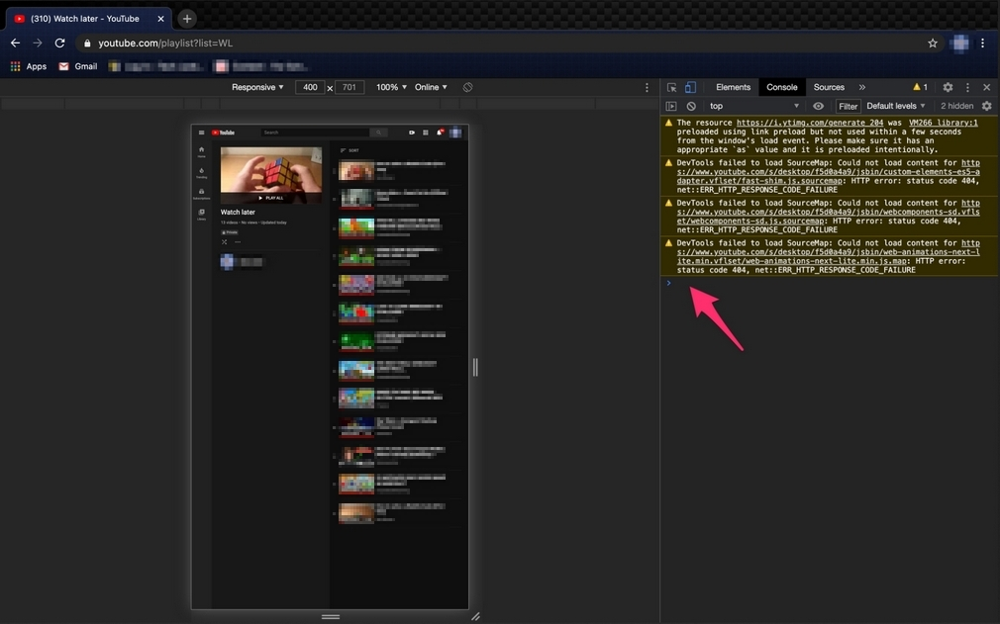

# Clear "Watch Later" youtube playlist
    
1. Open YouTube in your browser and navigate to the [Watch Later list](https://www.youtube.com/playlist?list=WL).
2. Open the console (F12) or (Ctrl + Shift + K) or (Command + Option + J)
3. Copy code from [script.js](script.js), paste and run it
4. Wait a little until it's done

Also, you can remove not available videos with this script. Might be needed to run for a few times.

### script.js
```
// Copy and paste this code into web browser console on page: https://www.youtube.com/playlist?list=WL
// v1a0, November 2021

var items = $('body').getElementsByClassName("style-scope yt-icon-button");

function deleter(i) {
  setTimeout(function timer() {
    items[30].click();
		try {
			var temp = $('body').getElementsByClassName("style-scope ytd-menu-popup-renderer")[3].click();
		}
		catch (e) {
			var temp = $('body').getElementsByClassName("style-scope ytd-menu-popup-renderer")[1].click()
		}
  }, 500*i);
}

for (var i = 0; i < items.length-30; ++i) {
  deleter(i)
}
```



---

#### Tags
    Using a Script to Remove All Watch Later Videos at Once
    Clear Watch Later WL youtube playlist
    How to Delete ALL Watch Later Videos from YouTube
    Deleting Saved Videos